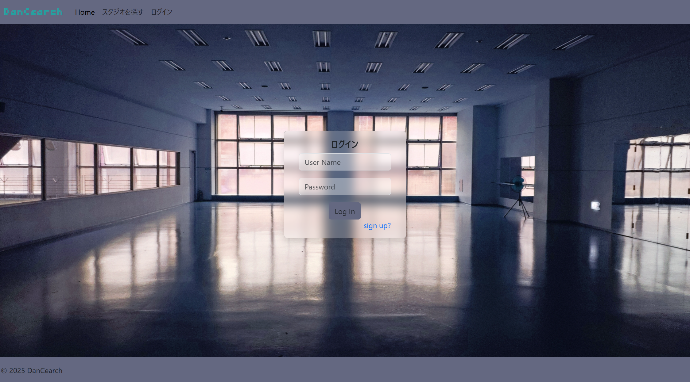
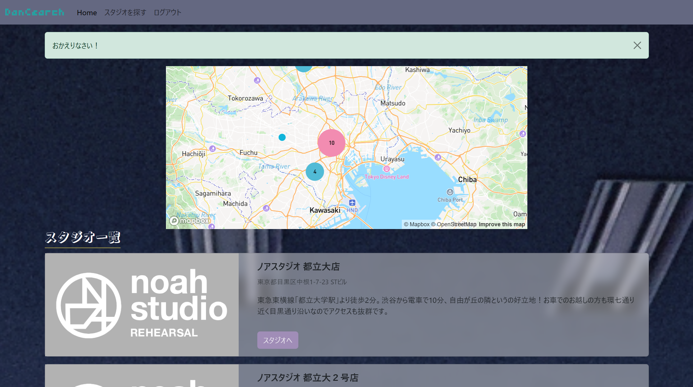
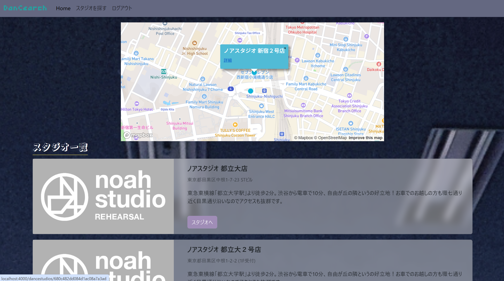
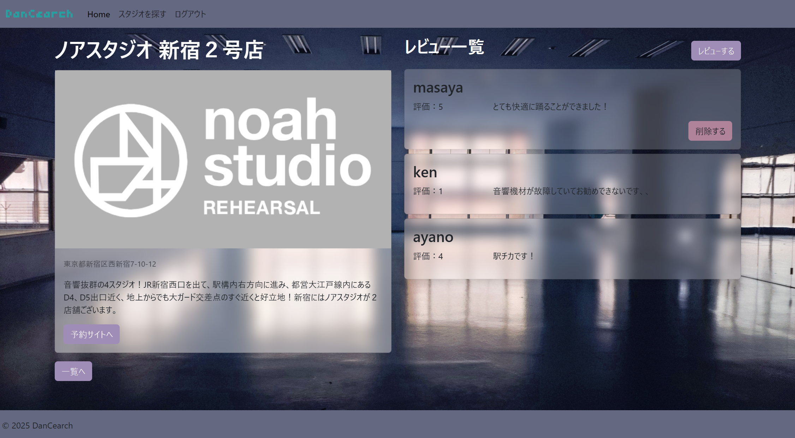

地図で便利にダンススタジオを探してそのまま予約できるサービス、「Dancearch」を開発中です。 （自分自身ダンサーなので便利なサービスを作りたい！と思って始めました）

★現在の開発進行状況 
・GoogleMapのAPIとmapboxを用いてスタジオの詳細な位置を地図に反映。地図から詳細ページへ。 
・ログイン機能はpassport.jsで実装。 
・スタジオ情報現在は試験的にはNOAHの全店舗と、BUZZの２店舗のみ。（これから実際に数を増やし、ゆくゆくは個人経営のスタジオとも連携してビジネス化予定） 
・ユーザーによるレビュー機能の実装。 
・デプロイは現在vercelで行っているが、まだ開発段階で機能していない部分も多い。 

実際の画面

ログイン：
スタジオを探す：
地図：
スタジオ詳細：
